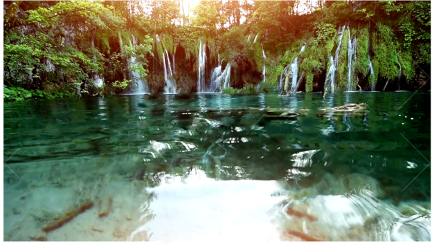

<!-- -->

### Welcome to Suitecase's Story pages

**_The story of Suitecase’s  plan to bring the ice cream._**

_As I have told you in my early stories, Suitecase lives in the sky on many islands._

_He also lives on earth. One of the island is Lake Island where there are ten lakes._ 

_In one of the lakes ice cream floats._ 

<b>Photo selection by SuiteCase's Friend</b>

_Now from earth Suitecase went to get ice cream from the lake island._

_He has a parachute. He created a big web called it Coneweb in the shape of a cone._

_He made it out of steel and gold._

_He covered the outside with paste made out of flower._

_He was trying to stick all the things together so it woud’nt  break and ice cream woud’nt fall off._

_It also for decoration._ 

_He filled it with ice cream and tied it up to the parachute._

_He opened the parachute  and started gliding from point A to reach point B on earth._

_It made a sound like oooooop!. He landed at point B._

_The Coneweb also landed with a splash. It cracked open in a door shape._

_He took the ice cream out, Put it in cones and started selling it._

_It has a unique taste that has nothing ever any one tasted before._

_It was all sold out._

**_People were vey happy and wanted more. Suitecase_**

 _Promised them that he would get more._

### Everyone was happy.

### Thank you for visiting my page.

_Will write more stories._

**The End.**
